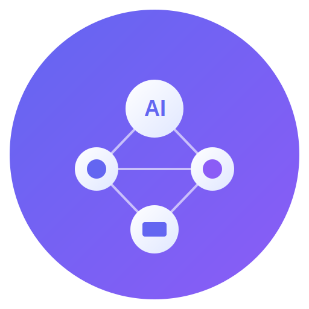

# AI SDK Gateway

<p align="center">
  
</p>

<p align="center">
  <strong>统一的多提供商 AI 聊天客户端</strong><br>
  <em>Unified Multi-Provider AI Chat Client</em>
</p>

<p align="center">
  
  
  
  
  
</p>

---

## ✨ 特性 Features

- 🔌 **20+ AI 提供商支持** - 云端、国内、本地推理全覆盖
- 💬 **流式响应** - 实时打字机效果输出
- 📁 **对话管理** - 文件夹组织、搜索、历史记录
- 🔐 **安全存储** - API 密钥加密存储
- ⌨️ **命令面板** - Ctrl+K 快速操作
- 🎨 **主题切换** - 明暗主题支持
- 📐 **可调布局** - 可拖拽调整侧边栏宽度
- 🖥️ **跨平台** - Web + Electron 桌面应用

---

## 🤖 支持的 AI 提供商 Supported Providers

### ☁️ 国际云服务 Cloud Providers

| Provider | Models | Features |
|----------|--------|----------|
| **OpenAI** | GPT-4o, GPT-4, GPT-3.5 | 对话、视觉、嵌入、TTS |
| **Anthropic** | Claude 3.5, Claude 3 | 对话、视觉、长上下文 |
| **Google** | Gemini 2.0, Gemini 1.5 | 对话、视觉、嵌入 |
| **Azure OpenAI** | GPT-4, GPT-3.5 | 企业级部署 |
| **Mistral** | Mistral Large, Medium | 对话、代码 |
| **Cohere** | Command R+, Command | 对话、RAG、重排序 |
| **Groq** | LLaMA 3, Mixtral | 超低延迟推理 |
| **Together AI** | 多种开源模型 | 按需推理 |
| **OpenRouter** | 100+ 模型 | 统一 API 网关 |
| **Cerebras** | LLaMA 3.1 | 极速推理 |

### 🇨🇳 国内提供商 China Providers

| Provider | Models | Features |
|----------|--------|----------|
| **DeepSeek** | DeepSeek V3, Coder | 对话、代码 |
| **Qwen (通义千问)** | Qwen 2.5 | 对话、视觉、代码 |
| **Moonshot (月之暗面)** | Kimi | 超长上下文 |
| **GLM (智谱清言)** | GLM-4 | 对话、代码 |

### 🖥️ 本地推理 Local Inference

| Provider | Description |
|----------|-------------|
| **Ollama** | 本地模型管理和推理 |
| **LM Studio** | 图形化本地模型运行 |
| **llama.cpp** | 高性能 CPU/GPU 推理 |
| **vLLM** | 高吞吐量推理服务 |

---

## 🏗️ 技术架构 Architecture

```
┌─────────────────────────────────────────────────────────────────┐
│                        Electron Main Process                     │
│  ┌─────────────┐  ┌─────────────┐  ┌─────────────────────────┐  │
│  │   Window    │  │   IPC       │  │   Secure Storage        │  │
│  │   Manager   │  │   Bridge    │  │   (keytar/electron-store)│  │
│  └─────────────┘  └─────────────┘  └─────────────────────────┘  │
└─────────────────────────────────────────────────────────────────┘
                              │ IPC
┌─────────────────────────────────────────────────────────────────┐
│                        Renderer Process                          │
│  ┌─────────────────────────────────────────────────────────────┐│
│  │                      React Application                       ││
│  │  ┌─────────┐  ┌─────────┐  ┌─────────┐  ┌─────────────────┐ ││
│  │  │  Chat   │  │ Settings│  │  Admin  │  │ Command Palette │ ││
│  │  │  View   │  │  View   │  │  View   │  │    (Ctrl+K)     │ ││
│  │  └─────────┘  └─────────┘  └─────────┘  └─────────────────┘ ││
│  │                          │                                   ││
│  │  ┌───────────────────────────────────────────────────────┐  ││
│  │  │                    AI SDK Core                         │  ││
│  │  │  ┌─────────┐  ┌─────────┐  ┌─────────┐  ┌───────────┐ │  ││
│  │  │  │ Client  │  │ Factory │  │ Registry│  │ Adapters  │ │  ││
│  │  │  └─────────┘  └─────────┘  └─────────┘  └───────────┘ │  ││
│  │  │  ┌─────────┐  ┌─────────┐  ┌─────────┐  ┌───────────┐ │  ││
│  │  │  │ Cache   │  │ Queue   │  │Middleware│  │  Storage  │ │  ││
│  │  │  └─────────┘  └─────────┘  └─────────┘  └───────────┘ │  ││
│  │  └───────────────────────────────────────────────────────┘  ││
│  └─────────────────────────────────────────────────────────────┘│
└─────────────────────────────────────────────────────────────────┘
                              │ HTTP/SSE
┌─────────────────────────────────────────────────────────────────┐
│                      AI Provider APIs                            │
│   OpenAI │ Anthropic │ Google │ Azure │ Ollama │ ...            │
└─────────────────────────────────────────────────────────────────┘
```

### 核心模块 Core Modules

| 模块 | 路径 | 描述 |
|------|------|------|
| **Adapters** | `src/lib/ai/adapters/` | 各提供商 API 适配器 |
| **Client** | `src/lib/ai/client.ts` | 统一客户端接口 |
| **Factory** | `src/lib/ai/factory.ts` | 提供商实例工厂 |
| **Registry** | `src/lib/ai/registry.ts` | 提供商注册与路由 |
| **Gateway** | `src/lib/ai/gateway/` | 统一 API 网关 |
| **Storage** | `src/lib/ai/storage/` | 数据持久化层 |
| **Models** | `src/lib/ai/models/` | 数据模型（对话、消息、API Key） |
| **Transport** | `src/lib/ai/transport/` | HTTP/IPC 传输层 |
| **Middleware** | `src/lib/ai/middleware.ts` | 请求/响应中间件 |
| **Cache** | `src/lib/ai/cache.ts` | 响应缓存 |
| **Queue** | `src/lib/ai/queue.ts` | 请求队列与限流 |

---

## 📁 项目结构 Project Structure

```
├── electron/                  # Electron 主进程
│   ├── main.ts               # 主进程入口
│   └── preload.ts            # 预加载脚本
├── src/
│   ├── components/
│   │   ├── chat/             # 聊天组件
│   │   ├── layout/           # 布局组件
│   │   ├── settings/         # 设置组件
│   │   └── ui/               # shadcn/ui 组件库
│   ├── context/              # React Context
│   ├── hooks/                # 自定义 Hooks
│   ├── lib/
│   │   └── ai/               # AI SDK 核心
│   │       ├── adapters/     # 提供商适配器
│   │       ├── core/         # 核心服务
│   │       ├── gateway/      # API 网关
│   │       ├── models/       # 数据模型
│   │       ├── storage/      # 存储层
│   │       └── transport/    # 传输层
│   ├── pages/                # 页面组件
│   └── views/                # 视图组件
├── build/                    # Electron 构建资源
└── public/                   # 静态资源
```

---

## 🚀 快速开始 Quick Start

### 环境要求 Prerequisites

- Node.js >= 18
- npm or bun

### Web 开发模式

```bash
# 安装依赖
npm install

# 启动开发服务器
npm run dev
```

### Electron 开发模式

```bash
# 同时启动 Vite 和 Electron
npm run electron:dev
```

### 构建生产版本

```bash
# 构建 Web 版本
npm run build

# 构建 Electron 应用
npm run electron:build

# 构建特定平台
npm run electron:build:mac
npm run electron:build:win
npm run electron:build:linux
```

---

## ⌨️ 键盘快捷键 Keyboard Shortcuts

| 快捷键 | 功能 |
|--------|------|
| `Ctrl/Cmd + K` | 打开命令面板 |
| `Ctrl/Cmd + N` | 新建对话 |
| `Ctrl/Cmd + ,` | 打开设置 |
| `Ctrl/Cmd + B` | 切换侧边栏 |
| `Escape` | 关闭对话框/面板 |

---

## ⚙️ 配置 Configuration

### API 密钥配置

1. 打开应用设置（齿轮图标或 `Ctrl+,`）
2. 选择 "API Keys" 选项卡
3. 为所需提供商添加 API 密钥

密钥将使用系统密钥链（Electron）或加密存储安全保存。

### 添加自定义提供商

```typescript
import { createCustomProvider } from '@/lib/ai';

const myProvider = createCustomProvider({
  name: 'My Provider',
  baseUrl: 'https://api.myprovider.com/v1',
  apiKey: 'your-api-key',
  models: ['model-1', 'model-2'],
});
```

---

## 🔧 开发指南 Development Guide

### 添加新的 AI 提供商

1. 在 `src/lib/ai/adapters/` 创建适配器文件
2. 继承 `BaseAdapter` 类
3. 实现 `chat()` 和 `chatStream()` 方法
4. 在 `src/lib/ai/adapters/index.ts` 导出
5. 在 `src/lib/ai/providers-metadata.ts` 添加元数据

```typescript
// src/lib/ai/adapters/my-provider-adapter.ts
import { BaseAdapter } from './base-adapter';

export class MyProviderAdapter extends BaseAdapter {
  async chat(messages, options) {
    // 实现聊天逻辑
  }

  async *chatStream(messages, options) {
    // 实现流式响应
  }
}
```

### 自定义主题

编辑 `src/index.css` 中的 CSS 变量：

```css
:root {
  --background: 0 0% 100%;
  --foreground: 222.2 84% 4.9%;
  --primary: 222.2 47.4% 11.2%;
  /* ... */
}

.dark {
  --background: 222.2 84% 4.9%;
  --foreground: 210 40% 98%;
  /* ... */
}
```

---

## 📄 许可证 License

MIT License - 详见 [LICENSE](LICENSE) 文件

---

<p align="center">
  Built with ❤️ using React, TypeScript, and Electron
</p>
